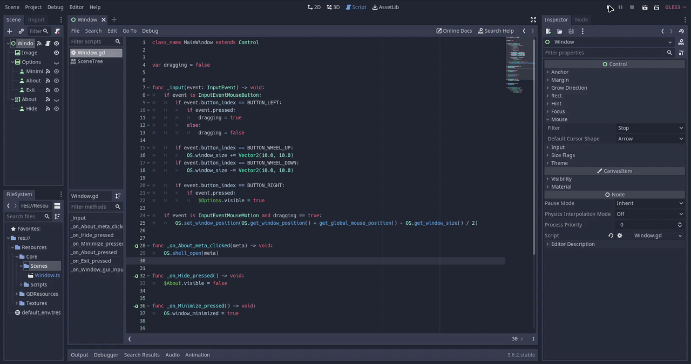

     
    A Konata desktop overlay~

<h1>KoDansu</h1>

Inspired from ***kona_dancer*** by *Izya* on May 12, 2007, KoDansu is a modern recreation of the app. Light and extensible.

## Features
- Resize via scroll wheel
- Right click opens `Options` of `Minimize`, `About`, and `Exit`
- Shaders for shadow and outline at hover

## Editing
1. Make a copy of ***Konata.tres*** `SubViewport` to `res://Scenes` folder.
2. On the scene, go to ***Frames*** node and set its `SpriteFrames` resource as unique.
3. Feel free to change the frames and its FPS, then save it.
4. Now you can load your new *skin* in any way you like!

## Credits
Here are credits to third-party assets I've used with their respective licenses.

### Assets
- Konata Izumi gif by [SrMecha](https://github.com/SrMecha), Repo: https://github.com/SrMecha/Desktop-Konata
- Konata Izumi edit, Pin: https://www.pinterest.com/pin/882987070693709066/

### Shaders
- [2D Circular Outline Shader](https://godotshaders.com/shader/2d-circular-outline-shader/) by [alfroids](https://godotshaders.com/author/alfroids/) (CC0 license)
- [All in one outline shader](https://godotshaders.com/shader/all-in-one-outline-shader/) by [gnamimates](https://godotshaders.com/author/gnamimates/) (CC0 license)

> Special thanks to Izya for being awesome and the modDB community for preserving their work!